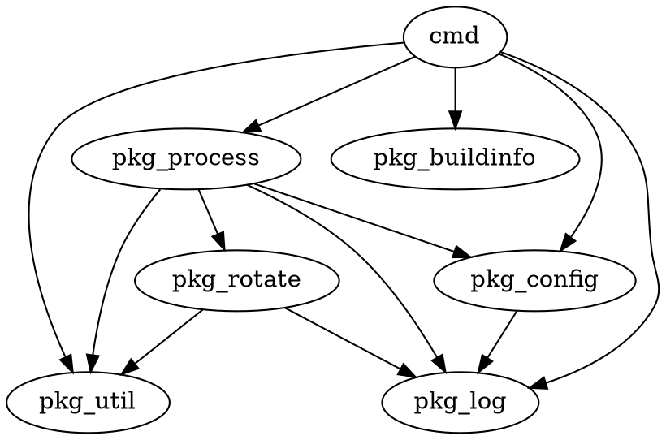
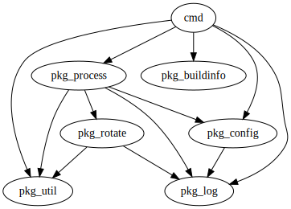

# baobab
Generate graphviz code for directories denpendency of a go mod project.  

## Usage

```bash
go get -u github.com/sequix/baobab
git clone https://github.com/sequix/sup.git
cd sup
baobab -gomod github.com/sequix/sup -entry cmd
```

You will get the following graphviz code.



Place the code in [here](https://dreampuf.github.io/GraphvizOnline) and behold:



## Why baobab?

> Now there were some terrible seeds on the planet that was the home of the
> little prince; and these were the seeds of the baobab. The soil of that planet
> was infested with them. A baobab is something you will never, never be able
> to get rid of if you attend to it too late. It spreads over the entire planet. It
> bores clear through it with its roots. And if the planet is too small, and the
> baobabs are too many, they split it in pieces...
